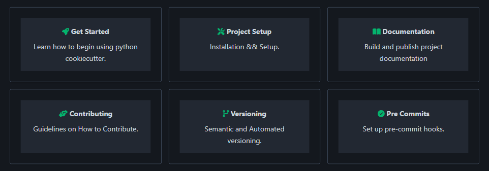

[](https://neuroinformatics.zulipchat.com/#narrow/channel/406003-Python-cookiecutter)
[](https://opensource.org/licenses/BSD-3-Clause)
[](https://github.com/astral-sh/ruff)
[](https://github.com/pre-commit/pre-commit)

# cookiecutter-python

A tool to automatically create a Python project structure ready to release via GitHub and [PyPI](https://pypi.org/).

[](https://github.com/neuroinformatics-unit/python-cookiecutter)

## Quick Install

First, install cookiecutter in your desired environment. Running in the terminal in your environment, with Pip:

```sh
pip install cookiecutter

# or conda:

conda install -c conda-forge cookiecutter
```
### Creating a Cookiecutter project

In the folder, you want to create the repo run:

```sh
cookiecutter https://github.com/neuroinformatics-unit/python-cookiecutter
```
You will be then asked a series of questions about how you want to set up your project.

## Getting Help

Here's how to learn more:

- **Getting Started Guide**: Learn setup steps and basics
- **Project Setup**: Instructions for initial configuration
- **Adding Features**: How to integrate new modules

[View Full Documentation →](docs/source/get_started.md)

## Contributing

We welcome contributions! See our Contribution Guidelines for workflow details.

## License
⚖️ [BSD 3-Clause](./LICENSE)
